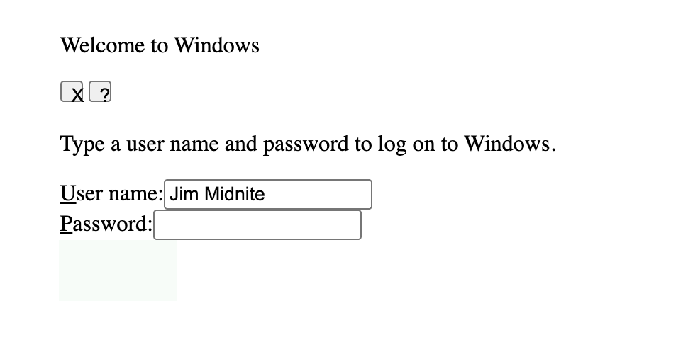
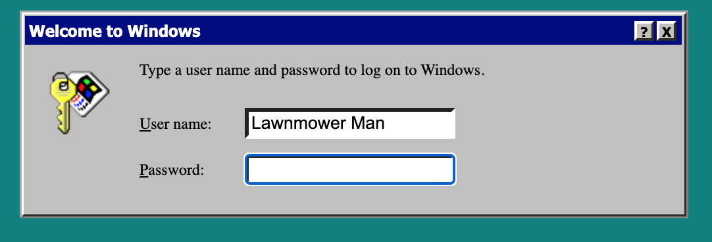

# win95password
References to Stephen King's Lawnmower Man
### Style Instructions ###
1.Before: 
1.After: 
### Script Instructions ###
On page load, execute a setup script to perform the following: 
1. Create two buttons inside the div with buttons id, labeled OK and Cancel (like the image below). 
* 
